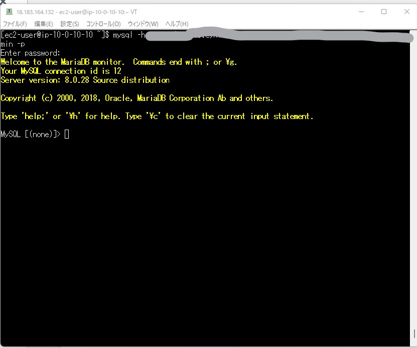
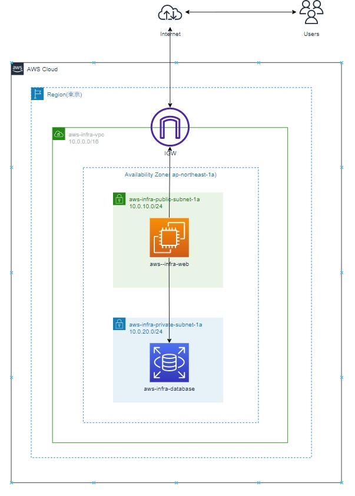

# 4回目課題  
## 課題内容  
- 新しくVPCを作成してEC2とRDSを構築してください
- EC2からRDSに接続して正常である事を確認して、正常である事を確認しましょう。
# 第4回講義で学んだ事  
# 用語詳細  
- リージョン・・・地域の区分け使える設定サービスが異なる
- アベイラビリティゾーン・・・独立したデータセンター(物理的なサーバーの置き場が異なる)　
- VPC・・・AWS上に仮想ネットワークを作成出来るサービスの名前
- サブネット・・・VPCを細かく区切ったネットワーク  
- IPアドレス・・・32ビットの整数値を8ビットごとに区分けしたもの、機器を判別する為のネットワーク上の住所。  
- CIDR表記・・・ネットワーク部とホスト部の区分けを表記する表記法  
- サブネットマスク表記・・・ネットワーク部を表す部分を1にホスト部を表すビットと同じ部分を0にする表記法  
- Apache・・・ WEBサーバーのソフトウェア  
- Erastic IPアドレス・・・IPアドレスを固定する事で、EC2再起動時にIPアドレスが変化しない。関連付けを外すのを忘れると料金が掛かる
# サーバー構築時の注意点  
- VPC作成後にpublic subnetへのルーティングが必要（インターネットゲートウェイを設定しVPCにアタッチし、ルートテーブルを作成し紐づけしないとインターネットに接続出来ない） 
- VPCはプライベートIPアドレスを使用  
- VPCとサブネットのIPアドレスの大きさは大きめに設定  
- インスタンス作成時パブリックIPの自動割り当てを有効にしないとインターネットに繋がらない 
- データベースサーバーはマルチAZのほうが可用性を向上させる事が出来る（別のAZを使うことで障害発生したとしても稼働継続可能）
ただしサーバーの料金が2倍になるので注意。
- データベースサーバーは停止しても7日後に自動で再起動される。  

#### 成功画像  
- MySQL接続確認
  
- AWS構成図
  
#  課題から学んだ事
少しでもルーティングを間違えると、アプリケーションサーバー、データベースサーバーは起動しない。  
動かない場合は要因解析をすればだいたいの問題は解決しそう。  
自分がどういう形でサーバーの設定をしているのか形に残すという意味でも、ＡＷＳ構成図を書けるようになるのは必須だと思いました。  
（目に見える形で表現する事でトラブル時にOK、NGの範囲の切り分けが可能になる）
