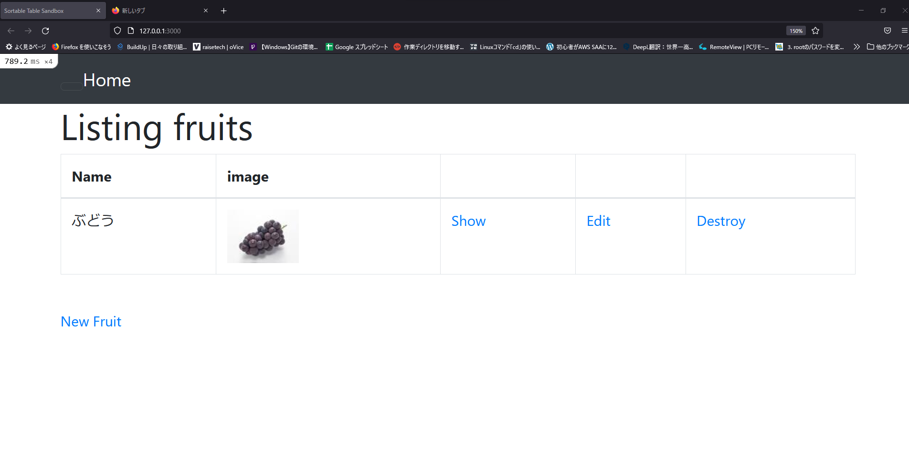
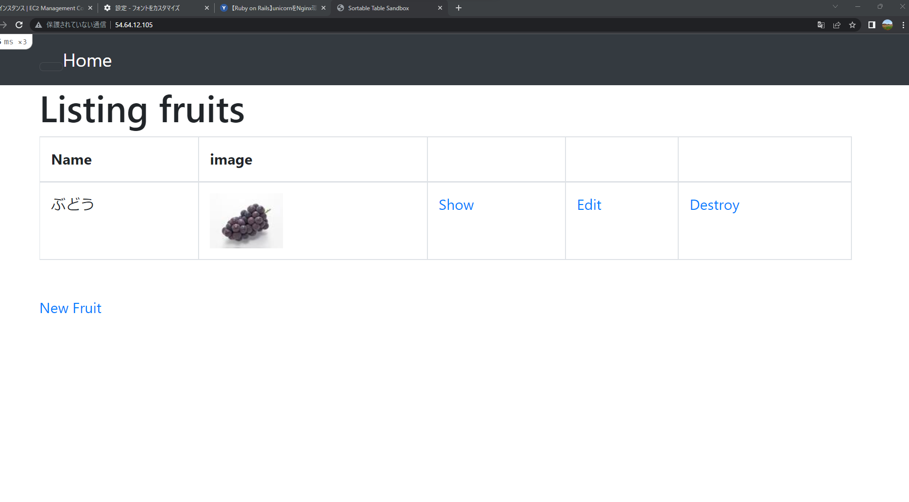
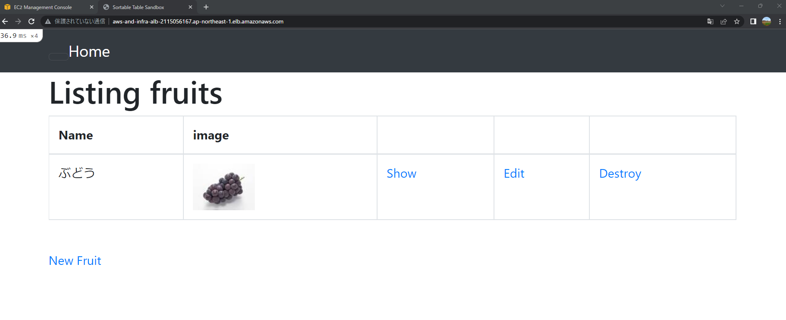
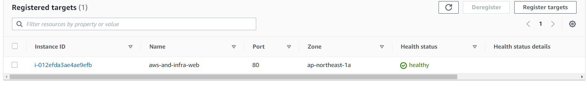
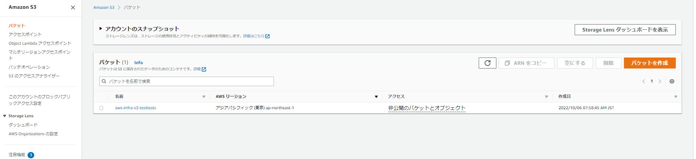

# 5回目課題  
## 課題内容  
- EC2上にサンプルアプリをデプロイしましょう。
### 手順
1. まずは組み込みサーバーだけで起動させる
2. サーバーアプリケーションを分けて起動
3. ELB（ALB）を追加する
4. ELBの動作を確認出来たらS3を追加しましょう
- 作成した環境をAWS構成図で作成して下さい。
# 第5回講義で学んだ事  
- サーバーをデプロイする上で構成を冗長化をさせるのは必須
- ELBは負荷分散で冗長化を実現している。  
### ELBの種類  
1. ALB・・・HTTP/HTTPSに特化したロードバランサー、WEBアプリケーションであれば基本これを選ぶ
2. NLB・・・発信元のIPの固定化が可能  
### S3の利用
- 時間と共に容量が増えていく可能性のあるものに関してはS3を使用する。  
#### 主な利用は用途は
- 画像の保存
- 静的WEBサイト
### 構成図
- 環境を他人に説明しやすいようにAWS
  構成図を書く。
- 構成図の書く上でルールもあるので注意する事（使用するアイコンとか）
# サーバー構築時の注意点  
- 最初からサーバーを分けるのはNG。まずは最小構成からデプロイをすべき

#### 成功画像  
- 組み込みサーバーでアプリケーションをデプロイ
  
- サーバーアプリケーションを分けてデプロイ
  
- ELB（ALB）を追加
 
- ヘルスチェック通過画像
  
- S3を追加
  
- S3のALBアクセスログの詳細画面
  
## AWS構成図
  
#  課題から学んだ事
- RDSへの接続時に事前に設定しないと接続出来ない。
- 一度ハマり始めると収拾がつかなくなる可能性もある。定期的にbranchを切るなどして区切りの良い場所に戻れるようにしておくと、もしもの時に手戻りが少なくて済む。  
- アプリが使用しているポート番号を理解していないと設定間違えに気付けないので事前確認は大事
