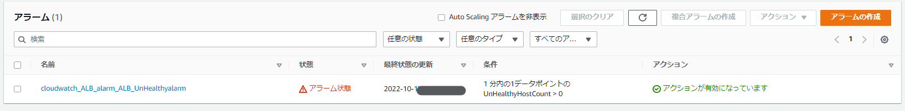
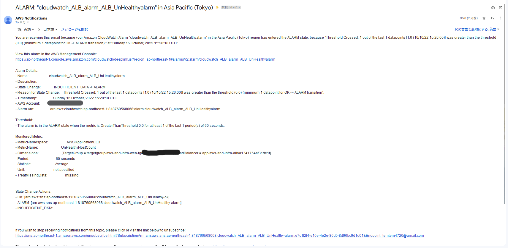
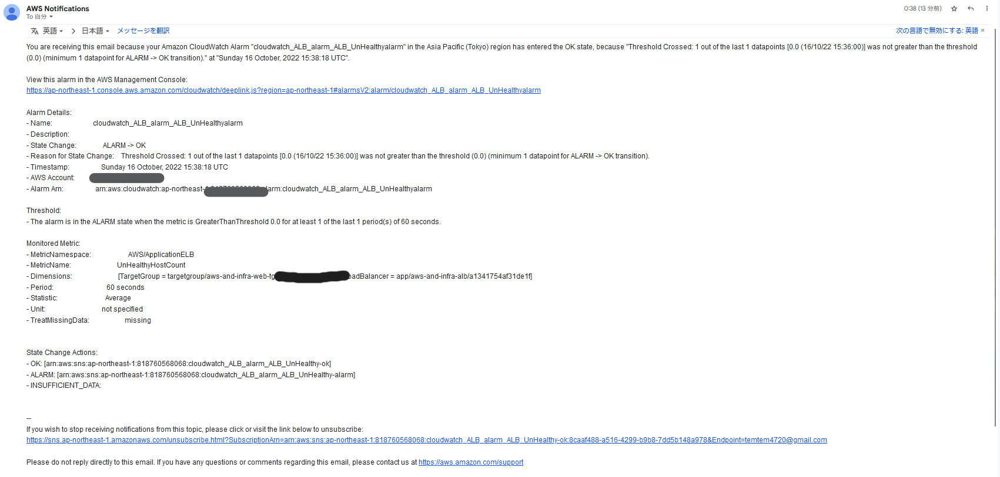
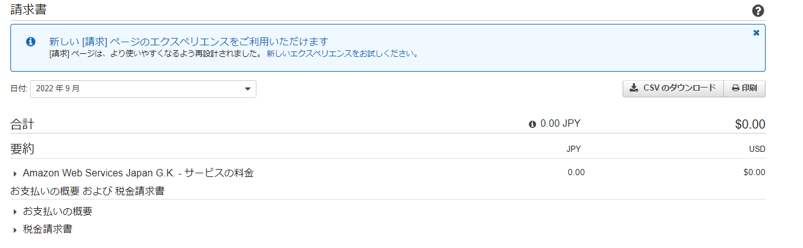
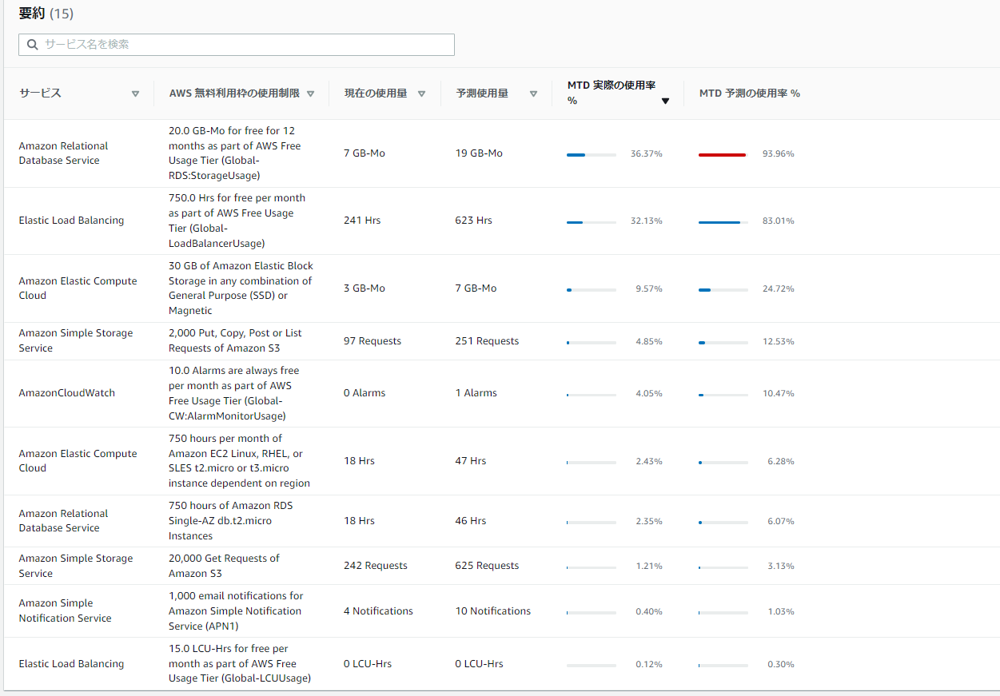

# 6回目課題  
## 課題内容  
- CroudTrailの利用記録を確認する。イベントと含まれている内容を３つピックアップして下さい。
- Cloudwatchのアラームを使って、ALBのアラームを設定してメール通知してみてください。
- OKアクションも今回は設定してください。
- アラームとアクションを設定した状態で、Railsアプリケーションが使える、使えない状態にして動作を確認してみる。
- 今日までに作成したリソースの内容で見積もりを出して下さい。
- マネジメントコンソールから現在の利用料を確認して無料枠でおさまっているか確認して下さい。 
# 第6回講義で学んだ事  
## 証跡、ロギング
- AWS CloudTrail・・サービスの証跡を確保する。
- AWS Config・・各種リソースの変更履歴を保管するサービス
- VPCフローログ・・VPCないの通信ログを取るサービス
- CloudWatchLogs・・OS領域が触れないAWSサービスのログを保管する。OSは管理したくない、ログだけは見たいというのを満たすサービス。
- システムの挙動がおかしいという時にシステムの裏側で何が起こったかを調べる為に証跡を残す事が大切。何も痕跡が残っていなければ調査のしようが無い。
- EventBridge・・AWSのイベントをただ記録するだけでなく、処理トリガーとして使う事も可能  
## AWSのコスト管理
- AWS pricing calculator・・利用料の見積が可能なツール
- Cost Explorer・・AWSの利用料を把握できるツール
- Budget・・予算を管理する事に特化したサービス、現在の推移で予算を超えそうかどうか予測出来る
- Cost Anomaly Detection・・コストの以上変動をAIが検知するサービス
#### 課題提出
1. CroudTrailの利用記録を確認する。イベントと含まれている内容を３つピックアップして下さい。  
イベント名:StopDBinstance  
内容：イベント発生時間、AWSアクセスキー、IPアドレス
  
2. CloudWatchアラームを使ってALBアラームを設定メール通知して下さい。
　アプリケーションを使える、使えない状態にしてどうなるか？  
アプリケーションを使えない状態→アラームが発生  
  
メール通知  
  
アプリケーションを使える状態→OKに変更  
メール通知
  
3. 作成したリソースの内容を見積もって下さい。
作成した見積りのURLを共有します。
https://calculator.aws/#/estimate?id=b1305a7df0441029daeb3ac3a9e86503c1c33e0d
4. マネジメントコンソールから現在の利用料を確認して教えて下さい。無料枠で収まっていますか？　

無料枠で収まっていました。
少し油断すると料金が発生しかねないので、定期的に確認した方が良いと感じました。  
無料枠内で使用出来ているのか確認

#  課題から学んだ事
- 証跡を取得する事で、障害時の原因を探したり出来る。運用時は必ず証跡を取るように心掛けようと感じました。
- 料金の確認はAWSを使う上では必須事項なので、使っていない時でもしっかり確認し予期せぬ料金が発生していない事を確認すべき。
- 記録がオンになっているだけで料金が発生するサービスも存在する。
