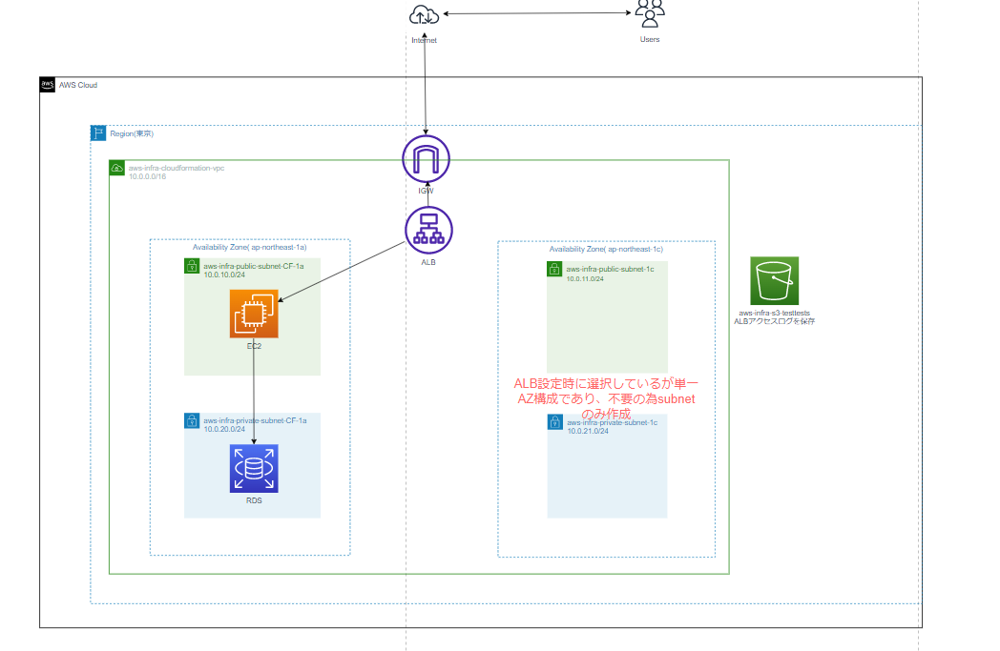

## １０回目講義課題
### 課題内容  
- CloudFormationを利用して、現在までに作った構成図をコード化する。 
#### 参考にした構成図
   

### 作成したスタック
- VPC(lecture10(VPC).yml)  
- security group(lecture10(SG).yml)  
- RDS(lecture10(RDS).yml)
- EC2(lecture10(EC2).yml)
- ALB(lecture10(ALB).yml)   
  
## 学んだ事
- 1個のスタックで完成させる事も可能だが、後から編集したい場合に編集箇所を探すのが大変になる。  
クロススタック参照を利用して複数のスタックでテンプレートを作成した方が後のメンテナンスがしやすい。
- マネジメントコンソールでその都度設定値を変えたい物はパラメーターで宣言しておくのが良い
- クロススタック参照でテンプレートを作成した場合スタック作成手順次第ではスタック作成出来ずにロールバックしてしまう。
- スタック作成画面のエラーメッセージは間違いではないが、原因がそこにあるとも限らないので要注意

## 不明点
- RDSのパスワードはパラメーターで設定したが、他の設定方法のが良かったか？（セキュリティ上の問題はあるか？）
- EC2はAMIを参照して作ったが、他のリージョンでは同じテンプレートが使えなくなってしまうので他の方法で定義した方が良いのか？

## 感想
色々なネット記事を参考に読んでみました。スタックの作成は最低限の形は決まっているが、それ以外は自由度が高いので他にも作成してみて自分に合った形を模索しておきたい。
