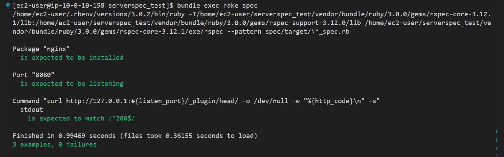

## 11回目講義課題
### 課題内容  
- サンプルコードをserverspecでテストし、成功させる。  
#### 成功画像   
  

## 学んだ事
- .sshファイル、秘密鍵の権限次第ではフォルダにアクセス出来ない事があるので、テスト前に権限周りの確認が必要。権限が異なる場合はコマンドによって付与する。
- テスト対象サーバーの状態次第ではポートが開かれていない可能性が高いので、テスト内容が失敗する場合は適切なポートが開かれているかテスト対象サーバーでss -tunlで確認するとポートの状態が分かりやすい。
- アプリケーションの起動、停止状態によってポートの状態が変わるのでNginxが起動している時は何番ポートがlisten状態になっているかなど理解しておく事が必須。

## 感想
テスト対象サーバーが増えれば増えるほどテストを手動で行うのはヒューマンエラーによる確認漏れなどが発生しやすいので、一度作ってしまえば使いまわしが出来るserverspecは非常に有益だと感じました。
インフラエンジニアを目指すのであれば使えるようになっておくべきツールなのでしっかり使いこなせるようになっておきたい。
