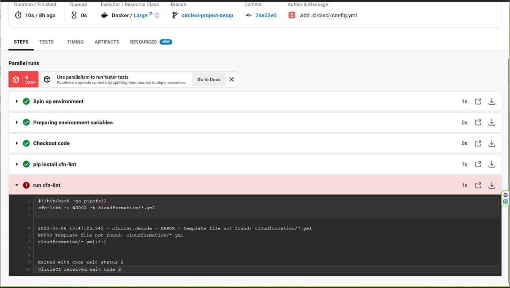
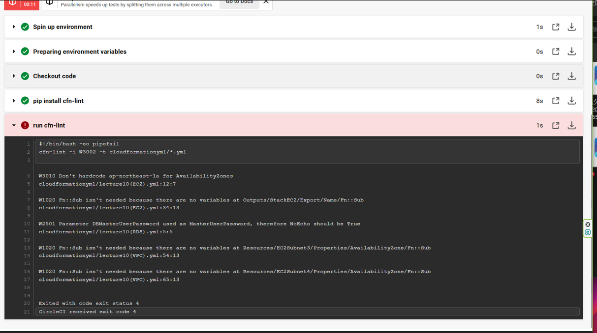
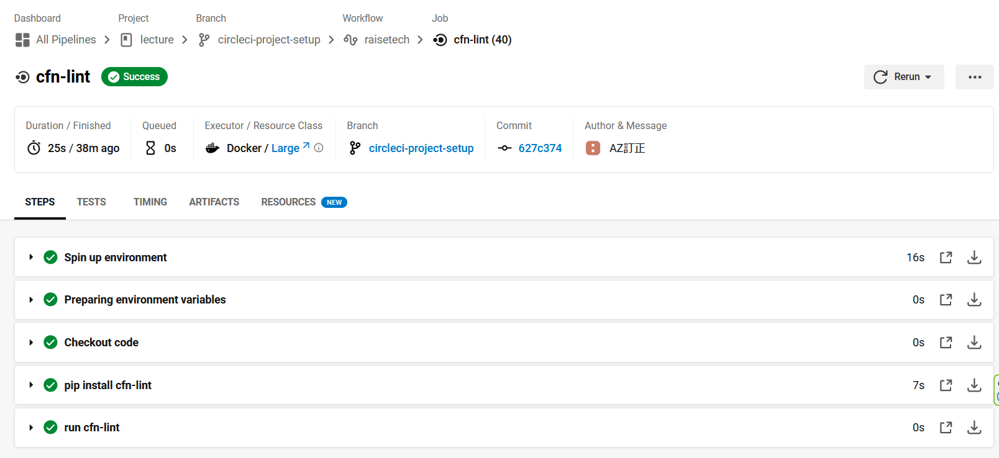

## 12回目講義課題
### 課題内容  
- CircleCIのサンプルコンフィグを正しく動作させるようにリポジトリに組み込む。  

### Terraform
- CloudFomationと比較すると、コードの記述がシンプル。構成に決まった型がある。
- Terraform自体にアップデートがありバージョンが上がるとコードが使用出来なくなる可能性有り。インフラ構成が変わっていないのにコードをアップデートしなければテンプレートを使えなくなるリスクがある。
- CloudFormationで実現が手間な繰り返しの記述が存在するので、同じ処理を繰り返す場合は使いやすい
### DevOps
- 開発と運用を組み合わせた言葉。
- 主に自動化されたインフラが要素としてあげられる。
- 各種自動化でダウンタイムをゼロとする仕組みが必要
- レブリケーション、冗長化、バックアップ、復旧の自動化が必要と求められる範囲が広い
### CI/CD
- 継続的インテグレーション、継続的デリバリーをする考え方
- ツールとしてCircleCI,GitHubAction,CodePipelineがある。
- それぞれ一長一短あるが、CodePipelineはAWSのサービスで統一されてしまうので自由度は低い
### Linter
- ソースコードが問題無いか確認してくれるツール
- pythonでソースコードの問題点を確認
- 今回のCircleCIのサンプルコンフィグもpythonのLinterにてcloudformationのコードを確認している
- Vscodeの拡張機能でもLinterが入れる事が出来ローカルでテンプレートのエラーを確認出来て便利。  
（コンソールにて```cfn-lint テンプレート.yml```で判定）
#### 初回失敗画像
     

初回は指定したパスが間違っており、ymlファイルが見つけられないと指摘を受ける。
→パスを指定し直して解決
#### ２回目失敗画像
  
Linterでymlファイルをチェックされ、ymlファイルのエラー内容が表示される。
→検索して該当するエラーをymlファイルを修正してエラーを消して解決
#### 3回目成功画像
  
無事CircleCIのJobがSuccessになっており、GithubへのCommitが成功している。

## 学んだ事
- CircleCIでJobを実行すると自動的にGithubの指定リポジトリ上にブランチが作成される。
- 今の自身の作業ブランチがどこか意識しないとCircleCIでプロジェクトが更新されなくて悩む事になる

## 感想
自動化には必須のCI/CDツールを初めて触ったが、UIが使いやすくGitHubよりも使いやすい印象を受けた。
今まで疎かにしてきたGitの理解不足で課題が進まなかったので、もっとGitを使いこなせるよう色々な機能を試しておきたい。
