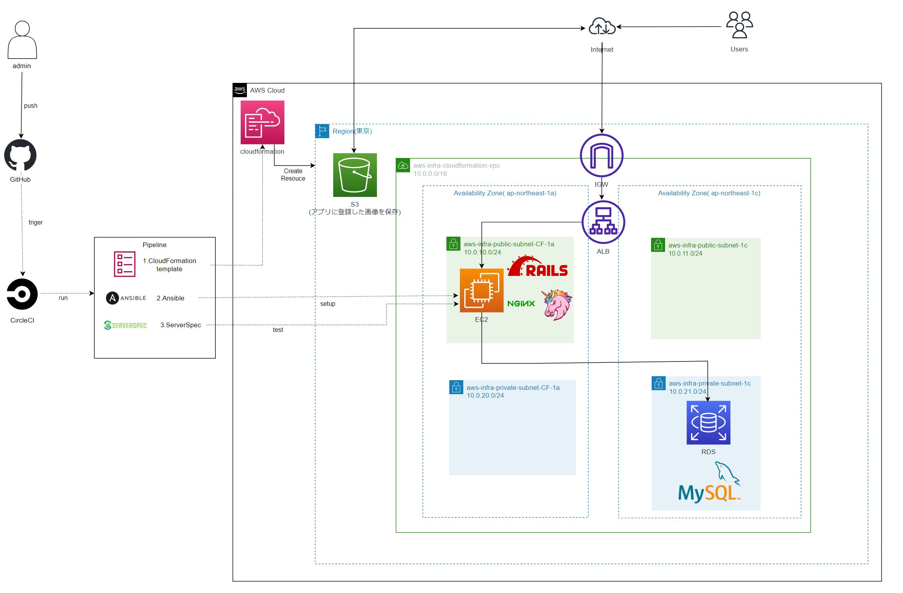

# 13回目、１４回目課題（最終課題）
## 課題内容  
- CircleCIのサンプルにServerSpecやAnsibleの処理を追加する。
- AWS構成図、リポジトリのREADMEを作成する。

## 方針
- CircleCIで簡単な構成でAnsibleのplaybookが成功するようにする。（ターゲットノードへGitをインストール）
- ServerspecでGitのインストール確認を実装
- Ansibleにサンプルアプリをデプロイするplaybookを作成  
- デプロイされたアプリをテストするServerspecのテストを作成

### 補足事項
- CloudFormationのテンプレートは[第１０回課題](https://github.com/akitoc342/lecture/tree/main/cloudformationymlfile)で作成した物を一部訂正して流用
(*S3のみ追加で作成)  
- デプロイ用のアプリは課題用に提供されている[サンプルアプリ](https://github.com/yuta-ushijima/raisetech-live8-sample-app)を使用

# 目次
- [13回目、１４回目課題（最終課題）](#13回目１４回目課題最終課題)
  - [課題内容](#課題内容)
  - [方針](#方針)
    - [補足事項](#補足事項)
- [目次](#目次)
    - [1.Ansibleの実装](#1ansibleの実装)
    - [2.ServerspecでGitのインストール確認を実装](#2serverspecでgitのインストール確認を実装)
    - [3.Ansibleにサンプルアプリをデプロイするplaybookを作成](#3ansibleにサンプルアプリをデプロイするplaybookを作成)
      - [3.1　credential.yml.enc,master.keyの設定](#31credentialymlencmasterkeyの設定)
      - [3.2　CloudFormationからRDSエンドポイント、ALBのDNS情報のAnsibleへの受け渡し](#32cloudformationからrdsエンドポイントalbのdns情報のansibleへの受け渡し)
      - [3.3 AWS ACCESS KEY ID,AWS　SECRET ACCESS KEYのAnsibleへの反映](#33-aws-access-key-idawssecret-access-keyのansibleへの反映)
      - [3.4 成功画面](#34-成功画面)
    - [4.アプリをテストするServerspecテストを作成](#4アプリをテストするserverspecテストを作成)
      - [4.1成功画面](#41成功画面)
    - [5.CircleCIパイプライン成功画面](#5circleciパイプライン成功画面)
  - [AWS構成図](#aws構成図)
  - [感想](#感想)


### 1.Ansibleの実装
- Ansibleのターゲットノードを設定する為にEC2のテンプレートにElasticIPの定義を追加
```cloudformation/lecture10EC2.yml
#ElasticIp定義
  IPAssoc:
        Type: AWS::EC2::EIPAssociation
        Properties:
            InstanceId: !Ref WebInstance
            EIP: 取得したElasticIP
```  
- Ansibleの処理をCircleCIへ加える
executeAnsibleの処理をCircleCIへ追加。
CircleCIのAdditional SSH KeysへHostNameを設定後表示されたFingerprintを/.circleci/config.ymlへ入力

[対象コード](https://github.com/akitoc342/CircleCI/blob/main/.circleci/config.yml) 

### 2.ServerspecでGitのインストール確認を実装
- Gitのインストール確認のテストを作成しテストの実施
```/sample_spec.rb
#Gitインストール確認
describe package('git') do
  it { should be_installed }
end
```
### 3.Ansibleにサンプルアプリをデプロイするplaybookを作成  
- AnsibleへGit以降のplaybookを作成
package（パッケージ、Nodejs、yarnのインストール）  
↓  
ruby(rubyインストール)  
↓  
mysql（MySQLインストール）  
↓  
appclone（サンプルアプリのclone） 
↓　 
bundler(bundleインストール)  
↓  
nginx（Nginxインストール）  
↓  
app（データベースセッティング、アプリデプロイ）  
の順で処理を追加  
#### 3.1　credential.yml.enc,master.keyの設定
- appcloneした状態のままだと環境変数を読めなくなってしまうので、config/credentials内に残っているdevelopment.yml.enc、production.yml.encを削除する。
```
- name: Deleate old credentials1
  file:
    path: /home/ec2-user/raisetech-live8-sample-app/config/credentials/development.yml.enc
    state: absent
- name: Deleate old credentials2
  file:
    path: /home/ec2-user/raisetech-live8-sample-app/config/credentials/production.yml.enc
    state: absent
```
- Ansibleで`bundle exec rails credentials:edit`が実行出来ない（vimから出られなくなるのかコマンドが通らない）。  
credentials.yml.encを復号出来る文字列を渡してやれば良いと判断しAnsibleVaultで暗号化してmaster.keyを渡す。
/ansible/vars.ymlファイルを暗号化した。  
AnsibleVaultPASSWORDはCircleCIの環境変数で渡す事にしました。


*参考[
Ansible Vault使い方 〜暗号化のための2つの方法〜 ](https://tech-blog.rakus.co.jp/entry/20230113/ansible#%E6%9A%97%E5%8F%B7%E5%8C%96%E3%81%AE%E5%8D%98%E4%BD%8D%E3%81%A8%E3%81%84%E3%81%86%E3%81%8B%E7%AF%84%E5%9B%B2%E3%81%AF2%E3%83%91%E3%82%BF%E3%83%BC%E3%83%B3%E3%81%82%E3%82%8B%E3%82%88)
  
#### 3.2　CloudFormationからRDSエンドポイント、ALBのDNS情報のAnsibleへの受け渡し
- CloudFomationで作成したリソースの情報をCircleCIのworkspaceを利用して取り出して、環境変数としてAnsileで使用する。

設定手順
1. CloudFormationからRDSエンドポイント、ALBのDNSを取り出し
 ```
          name: RDS endpoint set
          command: |
            mkdir -p /tmp/workspace
            RDS_ENDPOINT=$(aws rds describe-db-instances \
              --db-instance-identifier cloudformationRDS \
              --query "DBInstances[*].Endpoint.Address" \
              --output text > /tmp/workspace/rds-endpoint.txt)
            cat /tmp/workspace/rds-endpoint.txt
            aws elbv2 describe-load-balancers --names cloudformationALB --query "LoadBalancers[].DNSName" --output text> /tmp/workspace/alb-dns.txt

      - persist_to_workspace:
          root: /tmp/workspace
          paths:
            - rds-endpoint.txt
            - alb-dns.txt
```
2. Ansibleで1で取り出した情報を使用出来るようにする
```
- attach_workspace:
          at: /tmp/workspace
      - run: cat /tmp/workspace/rds-endpoint.txt
      - run: cat /tmp/workspace/alb-dns.txt
      - ansible-playbook/playbook:
          playbook: ansible/playbook.yml
          playbook-options: （中略） --extra-vars "RDS_ENDPOINT=$(cat /tmp/workspace/rds-endpoint.txt)" --extra-vars "ALB_DNS=$(cat /tmp/workspace/alb-dns.txt)"'
```
*参考[
例から学ぶ AWS CLI の クエリ(query)活用 ](https://dev.classmethod.jp/articles/learn-aws-cli-query-from-examples/)
[
ワークスペースによるジョブ間のデータ共有 ](https://circleci.com/docs/ja/workspaces/)    
#### 3.3 AWS ACCESS KEY ID,AWS　SECRET ACCESS KEYのAnsibleへの反映  
- AnsibleへのACCESS KEY ID、SECRET ACCESS KEYの反映はCircleCIの環境変数を使用した。  
```
echo export ACCESS_KEY_ID=$AWS_ACCESS_KEY_ID >> $BASH_ENV
echo export SECRET_ACCESS_KEY=$AWS_SECRET_ACCESS_KEY >> $BASH_ENV
source $BASH_ENV
```
- lookup変数を使用してCircleCIの環境変数を参照する。  
```
name: set environment vars 
  blockinfile:
    dest: "/home/ec2-user/.bash_profile"
    insertafter: EOF
    content: |
      export ACCESS_KEY='{{ (lookup('env','ACCESS_KEY_ID')) }}'
      export SECRET_ACCESS_KEY='{{ (lookup('env','SECRET_ACCESS_KEY')) }}'
- name: key env setting
  become_user: ec2-user
  shell: bash -lc "source ~/.bash_profile"
```
*参考[
環境変数の利用についておさらい ](https://zaki-hmkc.hatenablog.com/entry/2022/12/19/000930)  
#### 3.4 成功画面  
1. Ansible成功画面  
  
2. アプリ作動成功  
  
3. S3画像保存確認  
  

### 4.アプリをテストするServerspecテストを作成  
- Serverspecでのテスト内容（2.で実施したGitのインストール確認以外）  

1. Nginx起動確認  
```
describe service('nginx') do
  it { should be_running }
end
```
1. unicorn起動確認
```
describe command("ps aux | grep unicorn" ) do
  its(:stdout) { should contain("unicorn master") }
end
```
1. ALB_DNSでアクセスして200OKが返ってくるかの確認
```
describe command("curl http://#{ENV['ALB_DNS']}/ -o /dev/null -w \"%{http_code}\\n\" -s") do
its(:stdout) { should match /^200$/ }
end
```
#### 4.1成功画面  
  
### 5.CircleCIパイプライン成功画面
 
## AWS構成図  
 
## 感想  
- Ansibleで何をやっても実行できないコマンドがあり、かなりハマりました。  
どうしても解決しそうに無い場合は別の方法を模索するのも手という事を学んだ。
- Ansible、CloudFormation、Severspec単独で見ればそれほど複雑では無かったが、CircleCIのパイプラインで一つの流れとして組み込むと値の受け渡しにworkspaceを使用する必要がありかなり苦労した。
- 変更を加える度にターゲットノードのインスタンスにログイン確認してという方法を取ったのでかなり時間が掛かった。しかし少しずつ変更を確認したことにより、大きな手戻りはする事が無かったのは良かったです。
